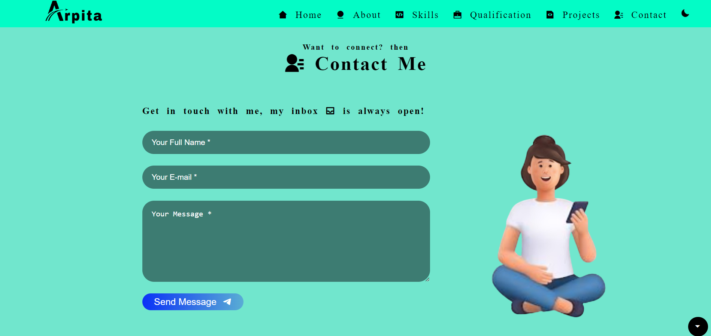

<h2 align="left">My First portfolio-website</h2>

Portfolio website build using HTML, CSS, Javascript

<h4>You can visit my portfolio from here 👉 
</h4>
 
<h2 align="left">💻 Languages used :</h2>

  

 

 

  
 <h2 align="left">💻 Tool used :</h2>
 

 

  <h2 align="left">📌 Some screenshot of my portfolio-site :</h2>
  
  

 

   <h2 align="left"> 📞Contact :</h2>
   
Feel free to reach me through the below handles if you'd like to contact me.

  
  
